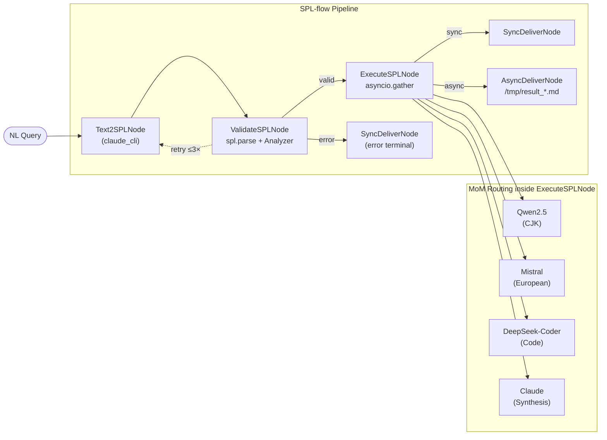

# SPL-flow Experiments

Experiment scripts that generate the evidence for the SPL paper (§9 Extensions).

## SPL-flow Architecture (PocketFlow Orchestration)



**Key design points:**
- `Text2SPLNode` is hardwired to `claude_cli` regardless of the `--adapter` flag
- `ValidateSPLNode` retries up to 3× with parse-error feedback in the prompt
- `ExecuteSPLNode` dispatches CTEs in parallel via `asyncio.gather`; MoM routing assigns each CTE to its specialist model based on keyword matching in the `GENERATE` clause
- Adapter flag (`--adapter`) controls only the execution step

---

## `run_text2spl.py` — Text2SPL E2E Runner

**Paper section:** §9.1 (Text2SPL) and §9.2 (Mixture-of-Models routing)

### What it does

| Phase | Command | What happens |
|-------|---------|--------------|
| **1** | `generate` (once per language) | NL query → SPL script via Text2SPL (always uses `claude_cli`) |
| **2** | `exec` × N adapters | Each generated `.spl` is executed with every selected adapter |

3 languages × 3 adapters = **9 execution runs** in one command.

### Output layout

```
~/Downloads/Zinets/spl-experiments/text2spl-<TIMESTAMP>/
├── summary.json          ← all metrics, machine-readable
├── english/
│   ├── generated.spl     ← SPL generated from the English query
│   ├── generate.log      ← Text2SPL generation log
│   ├── claude_cli/
│   │   ├── result.json   ← full execution result (tokens, cost, latency, per-CTE routing)
│   │   ├── result.md     ← human-readable final answer
│   │   └── exec.log      ← debug-level execution log
│   ├── openrouter/       ← same structure
│   └── ollama/           ← same structure
├── chinese/              ← same structure
└── arabic/               ← same structure
```

The default output root is `~/Downloads/Zinets/spl-experiments/`.
Override with `--output-dir`.

### Prerequisites

```bash
# From the SPL-flow repo root:
pip install -r requirements.txt   # includes click

# For openrouter adapter:
export OPENROUTER_API_KEY=sk-or-...

# For ollama adapter:
ollama serve   # in a separate terminal
```

### How to run

> **Important:** `claude_cli` cannot be launched inside an active Claude Code session.
> Run from a **regular terminal** (not the Claude Code shell), or prefix with `env -u CLAUDECODE`.

```bash
conda activate spl

cd ~/projects/digital-duck/SPL-flow

# Full run: all 3 languages × all 3 adapters (9 experiments)
env -u CLAUDECODE python3 experiments/run_text2spl.py

# claude_cli only (cheapest baseline, no API key needed)
env -u CLAUDECODE python3 experiments/run_text2spl.py --adapters claude_cli

# openrouter + ollama (skip claude_cli, e.g. when running inside Claude Code)
python3 experiments/run_text2spl.py --adapters openrouter,ollama

# Custom output directory
env -u CLAUDECODE python3 experiments/run_text2spl.py --output-dir /tmp/my-run

# Help
python3 experiments/run_text2spl.py --help
```

### CLI options

| Option | Default | Description |
|--------|---------|-------------|
| `--adapters` | `claude_cli,openrouter,ollama` | Comma-separated adapter list |
| `--output-dir` | `~/Downloads/Zinets/spl-experiments/text2spl-<TS>` | Root output directory |

### Console output

The script prints three summary tables at the end:

1. **Phase 1 — Text2SPL Generation** — per-language status, SPL line count, time
2. **Phase 2 — Execution Metrics** — per-experiment tokens / latency / cost
3. **Per-CTE Model Routing** — the MoM evidence: which model handled which CTE

---

## `spl_runner.py` — General-purpose SPL Automation CLI

A flexible runner for ad-hoc experiments: supply your own queries, your own `.spl` files,
or both — alongside any combination of adapters.

### Modes (combinable)

| Mode | Flag | What happens |
|------|------|--------------|
| **Default** | *(no flags)* | Runs the 3 built-in queries (EN / ZH / AR) — same as `run_text2spl.py` |
| **Custom query** | `--query` / `-q` | NL → SPL (Phase 1) then exec (Phase 2) |
| **Pre-written script** | `--scripts` / `-s` | Skips Phase 1, executes `.spl` directly (Phase 2 only) |
| **Mixed** | `-q ... -s ...` | Generates from queries AND executes pre-written scripts in one run |

### How to run

> **Important:** `claude_cli` cannot be launched inside an active Claude Code session.
> Run from a **regular terminal**, or prefix with `env -u CLAUDECODE`.

```bash
cd ~/projects/digital-duck/SPL-flow

# Default: built-in 3 queries × all adapters (same as run_text2spl.py)
env -u CLAUDECODE python3 experiments/spl_runner.py

# Single custom question, claude_cli only
env -u CLAUDECODE python3 experiments/spl_runner.py \
    -q "Explain quantum entanglement in simple terms" \
    --adapters claude_cli

# Multiple custom questions, openrouter only
env -u CLAUDECODE python3 experiments/spl_runner.py \
    -q "What is a transformer architecture?" \
    -q "Compare BERT and GPT design choices" \
    --adapters openrouter

# Execute pre-written .spl files across adapters (no generation step)
python3 experiments/spl_runner.py \
    --scripts examples/radical_ri.spl,examples/llm_compare.spl \
    --adapters openrouter,ollama

# Mix: generate from a new question AND run an existing script
env -u CLAUDECODE python3 experiments/spl_runner.py \
    -q "My new research question" \
    --scripts examples/baseline.spl \
    --adapters claude_cli,openrouter

# Custom output directory
env -u CLAUDECODE python3 experiments/spl_runner.py \
    -q "Test question" --adapters claude_cli \
    --output-dir /tmp/my-run

# Help
python3 experiments/spl_runner.py --help
```

### CLI options

| Option | Short | Default | Description |
|--------|-------|---------|-------------|
| `--adapters` | `-a` | `claude_cli,openrouter,ollama` | Comma-separated adapter list |
| `--query` | `-q` | *(built-in 3)* | NL query to generate + execute. Repeatable. |
| `--scripts` | `-s` | — | Comma-separated `.spl` file paths to execute directly |
| `--output-dir` | `-o` | `~/Downloads/Zinets/spl-experiments/spl-runner-<TS>` | Root output directory |

### Naming convention for outputs

| Source | Directory name |
|--------|----------------|
| Single `--query` | `q1/` |
| Multiple `--query` | `q1/`, `q2/`, `q3/`, … |
| `--scripts path/to/foo.spl` | `foo/` (file stem) |
| Built-in queries | `english/`, `chinese/`, `arabic/` |

---

## Experiment - Text2SPL

### Q1 - English

```
Generate a multilingual table of Chinese characters containing the radical 日 (rì),
including character decomposition formula, pinyin, English meaning, Chinese explanation,
German translation, and natural insight.
```

Results: `~/Downloads/Zinets/spl-experiments/`

Log (first run via Streamlit): `logs/streamlit/streamlit-20260220-062710.log`

### Q2 - Chinese

```
用中文解释大型语言模型的工作原理，从参数知识、上下文知识和推理能力三个维度分析，
并对比GPT、Claude 和开源模型（如 Qwen ）的主要异同。
```

Explain (in Chinese) how large language models work, analysing them along three dimensions —
parametric knowledge, contextual knowledge, and reasoning capability — and compare the key
similarities and differences between GPT, Claude, and open-source models such as Qwen.


```bash

python -m src.cli run
  "用中文解释大型语言模型的工作原理，从参数知识、上下文知识和推理能力三个维度分析，并对比GPT、Claude和开源模型（如Qwen）的主要异同。" --adapter claude_cli --output chinese_test.json

```
### Q3 - Arabic

```
ما هي أبرز إسهامات العلماء العرب في تطوير علم الرياضيات والفلك خلال العصر الذهبي الإسلامي،
وكيف أثّرت هذه الإسهامات على العلوم الحديثة؟
```

What are the most notable contributions of Arab scholars to the development of mathematics
and astronomy during the Islamic Golden Age, and how did these contributions influence modern science?

---

## Experiment - Logical Chunking

**Paper section:** §9.3 — Declarative Map-Reduce for Long Contexts

**Status:** TODO — run after Text2SPL experiments

**Document:** "Attention Is All You Need" (Vaswani et al., 2017) — 4 logical sections:
Abstract+Intro, Model Architecture, Training, Results+Conclusions.
The LLM already knows the paper; no text injection needed.

**Script:** `experiments/chunking_transformer.spl`

**Command:**
```bash
cd ~/projects/digital-duck/SPL-flow

python3 experiments/spl_runner.py --scripts experiments/chunking_transformer.spl \
    --adapters openrouter --output-dir ~/Downloads/Zinets/spl-experiments/chunking-$(date +%Y%m%d)


python3 experiments/spl_runner.py --scripts experiments/chunking_transformer.spl --adapters openrouter --output-dir ~/Downloads/Zinets/spl-experiments/chunking-$(date +%Y%m%d)-v2

python3 experiments/spl_runner.py --scripts experiments/chunking_transformer_ollama.spl \
      --adapters ollama --output-dir ~/Downloads/Zinets/spl-experiments/chunking-$(date +%Y%m%d)-ollama


```


```

● The run is correct. The log tells a clean story:                                                                                                  
                                                          
  Map phase: perfectly parallel ✓                                                                                                                   
  14:01:33  [CTE:intro_summary]        starting  haiku-4.5  ─┐                                                                                      
  14:01:33  [CTE:architecture_summary] starting  haiku-4.5   │ all 4 at once                                                                        
  14:01:33  [CTE:training_summary]     starting  haiku-4.5   │                                                                                      
  14:01:33  [CTE:results_summary]      starting  haiku-4.5  ─┘                                                                                    

  14:01:36  training      done  3.5s  (1082 chars) ✓
  14:01:36  architecture  done  3.8s  (1231 chars) ✓
  14:01:37  intro         done  4.4s  (1659 chars) ✓
  14:01:38  results       done  5.2s  ( 984 chars) ✓
            ──── Map wall time: 5.2s (not 4×5.2 = 20.8s) ────

  Reduce phase: 32s for 1200 output tokens from Sonnet ✓
  14:01:38  transformer_review → Sonnet-4-5  (1635 input + 1200 output = 2835 tokens)
  14:02:10  done  37.5s total latency (includes Map CTE time)

  The display "2,835 tokens / $0.00" is misleading — spl_runner.py only reads execution_results from result.json, which only records the top-level
  PROMPT. The real totals from the log are:

  ┌──────────────────────┬────────────┬────────┬────────────┐
  │         Step         │   Model    │ Tokens │  Latency   │
  ├──────────────────────┼────────────┼────────┼────────────┤
  │ intro_summary        │ haiku-4.5  │ 469    │ 4.4s       │
  ├──────────────────────┼────────────┼────────┼────────────┤
  │ architecture_summary │ haiku-4.5  │ 473    │ 3.8s       │
  ├──────────────────────┼────────────┼────────┼────────────┤
  │ training_summary     │ haiku-4.5  │ 488    │ 3.5s       │
  ├──────────────────────┼────────────┼────────┼────────────┤
  │ results_summary      │ haiku-4.5  │ 484    │ 5.2s       │
  ├──────────────────────┼────────────┼────────┼────────────┤
  │ transformer_review   │ sonnet-4-5 │ 2,835  │ 32s        │
  ├──────────────────────┼────────────┼────────┼────────────┤
  │ Total                │            │ 4,749  │ 37.5s wall │
  └──────────────────────┴────────────┴────────┴────────────┘

  Map parallelism speedup: 5.2s vs ~20.8s sequential = 4× confirmed.

  This is exactly the §9.3 evidence you need. The cost=n/a in the table is a gap in the metrics pipeline (the openrouter adapter isn't surfacing
  per-CTE cost to result.json). The actual cost would be roughly:
  - 4 × 484 tok × haiku-4.5 rate ($1/$5 per M) ≈ $0.003
  - 2,835 tok × sonnet-4-5 rate ($3/$15 per M) ≈ $0.022
  - Total ≈ ~$0.025


```

### Adapter = Ollama

```bash
python3 experiments/spl_runner.py --scripts experiments/chunking_transformer.spl --adapters ollama --output-dir ~/Downloads/Zinets/spl-experiments/chunking-$(date +%Y%m%d)-v3
```

**Collect for Appendix C:**
- The `.spl` script
- The final synthesized review (Reduce phase output from `result.md`)
- Total tokens and cost from `result.json`

**What this demonstrates:** Declarative Map-Reduce — the same `.spl` runs in parallel (OpenRouter, seconds) or sequential overnight (Ollama, zero cost) without modification.

---

## Experiment - BENCHMARK

**Paper section:** §9.5 — Parallel Model Comparison

**Status:** TODO — run after Text2SPL experiments

**Script to benchmark:** The 日-family Chinese radical script (already validated):
```
~/Downloads/Zinets/spl-experiments/spl-9.2-A-20260220-063838.spl
```

**Command:**
```bash
cd ~/projects/digital-duck/SPL-flow

python3 -m src.cli benchmark /home/papagame/Downloads/Zinets/spl-experiments/spl-9.2-A-claude_cli-20260220-063838.spl --models "qwen2.5,qwen3,mistral,llama3.1,deepseek-r1,gemma3,phi4" --adapter ollama --output ~/Downloads/Zinets/spl-experiments/benchmark-ollama-$(date +%Y%m%d).json
```

**Collect for Appendix E:**
- Per-model table: model, input_tokens, output_tokens, latency_s, cost_usd, response excerpt
- Winning model + selection criterion used

**What this demonstrates:** A single `.spl` script run declaratively against multiple models; cost-quality trade-off made visible without changing any application code.

---

## MoM Routing — Existing Log Evidence

**Paper section:** §9.2 + Appendix B

**Status:** DONE — no new experiment needed

**Source log:** `logs/streamlit/streamlit-20260220-062710.log`

Key routing lines to extract for Appendix B:
```
06:41:22  INFO  [CTE:cjk_analysis] starting  model=qwen2.5
06:41:22  INFO  [CTE:german_translations] starting  model=mistral
06:41:36  INFO  [german_data] LLM response  model=claude-cli  tokens=86+199=285  latency=14180ms
06:42:01  INFO  [chinese_data] LLM response  model=claude-cli  tokens=134+540=674  latency=39110ms
06:42:18  INFO  [chinese_sun_radicals] LLM response  model=claude-cli  tokens=756+330=1086  latency=55848ms
```

---

## Dataset Preparation

**Paper context:** Real-world deployment evidence — SPL-flow was used to generate synthetic Q&A data across multiple domains.

We used SPL-flow to prepare synthetic data, e.g. questions across multiple domains in Math, Physics, Computer Science, and Chinese Language.

See `dataset/math-cs-physics-zh`

**Mention in paper:** Add 1–2 sentences in §9.4 or §11 (Conclusion/Broader Implications) noting that SPL-flow was used as a data preparation pipeline, demonstrating practical deployment beyond research experiments.
